<!-- Header -->

  

  

  
  
  
  

 

## ⚡ At a glance

<table align="center">
  <tr>
    <td align="center" width="150"><h3>11 yrs</h3>shipping production apps</td>
    <td align="center" width="150"><h3>50+</h3>apps on App Store &amp; Play</td>
    <td align="center" width="150"><h3>1M+</h3>users across my apps</td>
    <td align="center" width="150"><h3>4.7★</h3>rating at 100K+ daily users</td>
    <td align="center" width="150"><h3>9</h3>open-source pub.dev packages</td>
  </tr>
</table>

 

## 🧭 Why teams hire me

<table>
  <tr>
    <td width="33%" valign="top">
      <h3>📦 I ship end to end</h3>
      Architecture → code → tests → CI/CD → App Store & Play approval. Team lead <i>and</i> sole developer on products for clients in the US and Brazil.
    </td>
    <td width="33%" valign="top">
      <h3>🔌 Offline-first is my specialty</h3>
      Conflict-free CRDT sync, local-first databases, deterministic merges. The part that quietly breaks most apps in the field.
    </td>
    <td width="33%" valign="top">
      <h3>🧠 AI that respects privacy</h3>
      On-device models, LLM features with structured outputs and citations, and AI-assisted development with Claude Code under real code review.
    </td>
  </tr>
</table>

 

## 🚀 Building now: Hourwise

<table>
  <tr>
    <td>
      <b>Private, AI-assisted timekeeping and billing for solo lawyers and small firms.</b> 
      Founder and sole engineer · <a href="https://apps.apple.com/us/app/hourwise-billable-hours/id6811420308">Mac App Store</a> · <a href="https://ehsanur.com/hourwise/">ehsanur.com/hourwise</a> · <i>closed source</i>
        
      
      Native macOS menu-bar app: SwiftUI + AppKit (~17k lines of Swift), local-first SQLite/GRDB, on-device time attribution (rule engine + naive-Bayes classifier), EventKit, PDFKit invoices, LEDES 1998B / XLSX / CSV / QuickBooks / Xero exports, StoreKit 2.
    </td>
  </tr>
</table>

| Status | What I'm building | Stack |
|:---:|---|---|
|  | AI billing narratives written on-device, with billing-rule checks and UTBMS codes | Apple Foundation Models · SwiftUI |
|  | Private meeting capture → transcript, summary and draft time entry | ScreenCaptureKit · SpeechAnalyzer · on-device LLM |
|  | Backend: accounts, firm seats, CRDT sync across Swift, Dart and Python | Python · FastAPI · PostgreSQL · Fly.io |
|  | Mobile companion: timers, voice entries, court time, Live Activities | Flutter · WidgetKit · ActivityKit · Kotlin |
|  | "Ask my matters": tool-using agent with hybrid search, citations and evals | Claude API · pgvector · Postgres full-text |

I write up each stage as it ships — follow along on <a href="https://www.linkedin.com/in/sujit70777">LinkedIn</a>.

 

## 🛠️ Tech I work with

<b>Mobile & desktop</b>

  

<b>AI, data & backend</b>

  
   
  
  
  
  

<b>Shipping</b>

  
   
  
  
  

 

## 📦 Open source

| Package | What it does | pub points |
|---|---|---|
| **[flutter_crdt_sync_kit](https://pub.dev/packages/flutter_crdt_sync_kit)** | Offline-first, CRDT-based local data layer. Write offline, merge conflict-free on reconnect. Pluggable Supabase/REST adapters. |  |
| **[local_voice](https://pub.dev/packages/local_voice)** | Privacy-first, fully on-device voice command recognition. No cloud, no API keys, works in airplane mode. |  |
| **[flutter_a11y_lens](https://pub.dev/packages/flutter_a11y_lens)** | Live accessibility auditor that flags WCAG violations in the running widget tree via an on-screen overlay. |  |
| **[flutter_liquid_glass_widgets](https://pub.dev/packages/flutter_liquid_glass_widgets)** | Apple's Liquid Glass design language for Flutter: shader-powered blur, physics-based animation, dynamic lighting. |  |
| **[flutter_fabric](https://pub.dev/packages/flutter_fabric)** | Fabric.js's canvas interaction model for Flutter: selectable, draggable, rotatable objects with undo/redo. |  |

<a href="https://pub.dev/publishers/ehsanur.com/packages">All 9 packages on pub.dev →</a>

 

## 🏆 Shipped work

<table>
  <tr>
    <td width="50%" valign="top">
      <h3>🍎 <a href="https://apps.apple.com/us/app/hourwise-billable-hours/id6811420308">Hourwise</a></h3>
      Native macOS time tracking and invoicing for lawyers. Founder and sole engineer: design, build, App Store release and marketing.
    </td>
    <td width="50%" valign="top">
      <h3>🇧🇷 Tanto</h3>
      Brazilian corporate reimbursement: <b>AI invoice capture</b> validated against SEFAZ tax agencies, policy checks, instant Pix payout. Team lead and sole developer. <i>(Company closed Sept 2025.)</i>
    </td>
  </tr>
  <tr>
    <td width="50%" valign="top">
      <h3>🚗 <a href="https://play.google.com/store/apps/details?id=com.app.farenow">Farenow</a></h3>
      Multi-service super app for a US client (Houston, TX): ride-hailing, bookings, food and grocery delivery, consultations and marketplace in one Flutter app. Team lead and sole developer.
    </td>
    <td width="50%" valign="top">
      <h3>🎓 <a href="https://play.google.com/store/apps/dev?id=6504002943007145339">Prabartan Educational Platform</a></h3>
      Offline-capable learning apps for <b>100,000+ students in 5 countries</b>, 4.7★ at 100K+ daily active users. Led a 6-developer team.
    </td>
  </tr>
  <tr>
    <td width="50%" valign="top">
      <h3>🔐 <a href="https://apps.apple.com/us/app/pom-app/id6760588055">Peace of Mind (POM)</a></h3>
      iOS estate planning: digital wills, biometric-locked vault, life timeline. Fixed StoreKit 2 subscription race conditions and duplicate-purchase bugs.
    </td>
    <td width="50%" valign="top">
      <h3>🕌 <a href="https://apps.apple.com/us/app/muslim-times-pro-prayer-quran/id6740039144">Muslim Times Pro</a></h3>
      Prayer times, full Quran, mosque locator, Qibla. WidgetKit widgets sharing live data with Flutter via App Groups, mirrored on Android.
    </td>
  </tr>
</table>

  
<b>🧪 Side projects</b> (click to expand)

   

  - **[OMR Scanner](https://github.com/sujit70777/omr_scanner_flutter)** — Fully offline exam answer-sheet scanner using registration-mark alignment and homography instead of OCR, with live camera guidance and auto-capture.
  - **[Jatri — Bangladesh Transit App](https://github.com/sujit70777/Jatri---Bangladesh-Transit-App)** — Journey planner and ticketing app built on real MRT Line 6 and BRTA route data.
  - **[ar_measure](https://github.com/sujit70777/ar_measure)** — Cross-platform AR measurement plugin for Flutter, wrapping ARKit and ARCore.

 

## 📊 Languages

  

 

## 🤝 Let's work together

  <b>Open to remote Senior Mobile and AI Engineer roles, and contract work — US, UK and EU teams.</b> 
  Full-time or independent contractor (B2B) via Deel, Wise or direct invoice. Three years of shifted hours with a Brazil-based team, so your time zone is routine for me.

  
  

<!-- Footer -->

  

